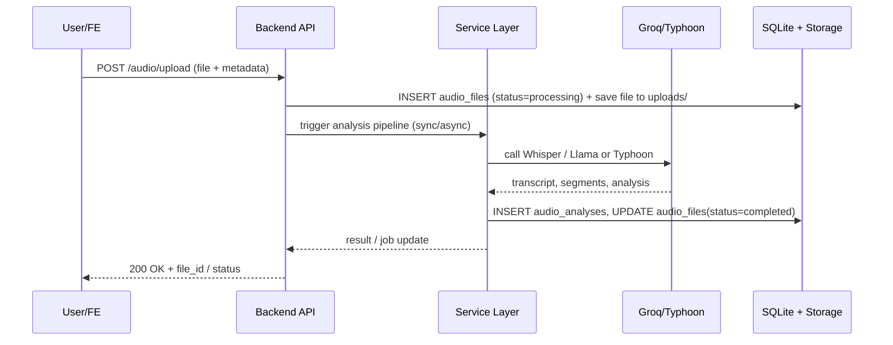

# System Architecture — ProjectNoW

Version: implementation-aligned, developer-friendly

This document describes the real system architecture for your ProjectNoW backend (Warranty + Audio AI Analysis). It maps directly to the code in this repository and references the canonical files and services used in the project.

---

## 1. Summary

ProjectNoW is a FastAPI-based backend that provides warranty management and an audio-AI analysis pipeline. The system stores metadata and analysis results in SQLite and stores audio files on local disk under `storage/`. AI integrations include Groq (Whisper + Llama) and optional Typhoon + pyannote for STT/diarization.

Key repo locations:

- API + app entry: [main.py](main.py)
- Database schema and DB helpers: [database/schema.sql](database/schema.sql#L1-L999) and [database/db.py](database/db.py#L1-L999)
- Routers: [routers/](routers/)
- Services (AI pipelines + converters): [services/](services/)
- Storage folders: `storage/uploads`, `storage/converted`, `storage/exports`

---

## 2. High-level Components

- Frontend (Admin dashboard / Upload UI / Reports)
- Backend API (FastAPI): routes in `routers/` and orchestration logic in `services/`
- Database: SQLite (`database/fontai.db`) schema defined in [database/schema.sql](database/schema.sql#L1-L999)
- File Storage: local directories under `storage/`
- AI Integrations: Groq (Whisper + Llama), optional Typhoon STT and Pyannote diarization
- Auth & Audit: `admin_users`, `admin_activity_logs`

---

## 3. Component Map (Mermaid)

Paste the following into a Markdown file or into https://mermaid.live to visualize.

### 3.1 System overview

```mermaid
flowchart LR
  subgraph CLIENT ["Client / Frontend"]
    FE[Admin Dashboard<br/>Upload UI / Reports]
  end

  subgraph BACKEND ["Backend (FastAPI)"]
    API[API Layer<br/>routers/]
    SVC[Service Layer<br/>services/]
    DB[(SQLite: fontai.db)]
    FS[(Storage: uploads/ converted/ exports/)]
  end

  subgraph AI ["AI Integrations"]
    GROQ[Groq (Whisper + Llama)]
    TYPHOON[Typhoon STT]
    PYANNOTE[Pyannote Diarization]
  end

  FE -->|HTTPS JSON| API
  API --> SVC
  SVC --> DB
  SVC --> FS
  SVC --> GROQ
  SVC --> TYPHOON
  SVC --> PYANNOTE
```

### 3.2 Groq AI pipeline (detailed)

```mermaid
flowchart LR
  A[File Upload]
  B[Save metadata -> audio_files(status=processing)]
  C[Convert to WAV (file_converter.py)]
  D[Whisper Transcription (groq_whisper_transcribe)]
  E[Post-process segments (language filter, clean)]
  F[Fix Transcript (fix_transcript_chunked)]
  G[PII Masking (mask_pii_with_llama)]
  H[Llama Analyze (groq_llama_analyze)]
  I[Deep Insight (groq_llama_deep_insight)]
  J[Persist audio_analyses + update audio_files(status)]
  K[Notify frontend / Return result]

  A --> B --> C --> D --> E --> F --> G --> H --> I --> J --> K
```

### 3.3 Typhoon + Pyannote pipeline (alternative)

```mermaid
flowchart LR
  A[File Upload]
  B[Typhoon STT (transcribe_audio)]
  C[Pyannote Diarization (diarize_audio)]
  D[Merge transcript + speaker tags]
  E[Fix Transcript (chunked)]
  F[PII Masking]
  G[Llama Analyze]
  H[Deep Insight]
  I[Persist & Notify]

  A --> B --> C --> D --> E --> F --> G --> H --> I
```

### 3.4 Sequence: Upload → Processing



---

## 4. Data model & ERD notes

- The canonical schema is in [database/schema.sql](database/schema.sql#L1-L999). Key tables:
  - Warranty: `customers`, `addresses`, `brands`, `categories`, `products`, `channels`, `warranty_registrations`, `proof_of_purchase`, `activities`
  - Admin: `admin_users`, `admin_activity_logs`
  - Audio AI: `agents`, `audio_files`, `audio_analyses`

- Important detail: `agents.agent_id` is a TEXT primary key (seeded values like `AGENT-102`). `audio_files.agent_id` in the current schema is `TEXT DEFAULT 'N/A'` and does NOT include a `REFERENCES agents(agent_id)` foreign key. This is intentional (allows files without known agents). If you want enforced referential integrity, migrate `audio_files.agent_id` to NULLable and add the FK.

### ER diagram (mermaid erDiagram)

```mermaid
erDiagram
  CUSTOMERS {
    INTEGER customer_id PK
    TEXT first_name
    TEXT last_name
    TEXT email UNIQUE
  }
  ADDRESSES {
    INTEGER address_id PK
    INTEGER customer_id FK
    TEXT address_line
  }
  BRANDS {
    INTEGER brand_id PK
    TEXT brand_name UNIQUE
  }
  CATEGORIES {
    INTEGER category_id PK
    TEXT category_name UNIQUE
  }
  PRODUCTS {
    INTEGER product_id PK
    INTEGER brand_id FK
    INTEGER category_id FK
    TEXT model
    TEXT serial_no UNIQUE
  }
  CHANNELS {
    INTEGER channel_id PK
    TEXT channel_name
  }
  WARRANTY {
    INTEGER registration_id PK
    TEXT registration_no UNIQUE
    INTEGER customer_id FK
    INTEGER product_id FK
    INTEGER channel_id FK
  }
  PROOF {
    INTEGER proof_id PK
    INTEGER registration_id FK
    TEXT file_url
  }
  ACTIVITIES {
    INTEGER activity_id PK
    INTEGER registration_id FK
    INTEGER admin_user_id FK
    TEXT comment
  }
  ADMIN_USERS {
    INTEGER admin_user_id PK
    TEXT username UNIQUE
    TEXT role
  }

  AGENTS {
    TEXT agent_id PK
    TEXT first_name
    TEXT last_name
  }
  AUDIO_FILES {
    TEXT file_id PK
    TEXT original_filename
    TEXT agent_id      "TEXT DEFAULT 'N/A'"
    TEXT status
    INTEGER created_by FK
  }
  AUDIO_ANALYSES {
    INTEGER analysis_id PK
    TEXT file_id FK
    TEXT transcript
  }
  ADMIN_LOGS {
    INTEGER log_id PK
    INTEGER actor_user_id FK
    TEXT action
  }

  CUSTOMERS ||--o{ ADDRESSES : has
  BRANDS ||--o{ PRODUCTS : produces
  CATEGORIES ||--o{ PRODUCTS : contains
  PRODUCTS ||--o{ WARRANTY : registered_in
  CHANNELS ||--o{ WARRANTY : used_by
  WARRANTY ||--o{ PROOF : has
  WARRANTY ||--o{ ACTIVITIES : has
  ADMIN_USERS ||--o{ ACTIVITIES : performed_by
  ADMIN_USERS ||--o{ ADMIN_LOGS : performed_by
  AUDIO_FILES ||--o{ AUDIO_ANALYSES : analyzed_as
  ADMIN_USERS ||--o{ AUDIO_FILES : created_by
  AGENTS ||--o{ AUDIO_FILES : "optional relation (agent_id is TEXT, not enforced FK)"
```

---

## 5. API surface (concise)

- `POST /audio/upload` — upload audio + metadata → creates `audio_files` record (status=processing). Implementation: see `routers/audio.py`.
- `GET /audio/{file_id}` — return `audio_files` + latest `audio_analyses` + status.
- `POST /audio/{file_id}/analyze` — re-run analysis pipeline (used to retry after rate limit or after fixes).
- `GET /agents` / `GET /detail/{agent_id}` — agent list and detail (see `routers/agents.py`).

Refer to actual router implementations in the `routers/` folder for exact request/response fields.

---

## 6. Operational notes & recommendations

- Configuration:
  - Provide Groq keys via `GROQ_API_KEYS` or `GROQ_API_KEY`, `GROQ_API_KEY_2`, ... (see `services/groq_ai_service.py`).
  - Set `WHISPER_MODEL` and `LLAMA_MODEL` in `services/groq_ai_service.py` if needed.

- Rate limiting:
  - `_retry_on_rate_limit` in `services/groq_ai_service.py` fails fast on 429 (user should re-trigger re-analyze). Optionally implement retries/backoff.

- Data integrity:
  - To enforce agent relation: migrate `audio_files.agent_id` values 'N/A' → NULL and add FK referencing `agents(agent_id)` (SQLite requires table recreate for FK addition). Consider PostgreSQL for easier migrations.

- Scaling suggestions for production:
  - Replace SQLite with PostgreSQL.
  - Move file storage to S3 (or other object storage).
  - Use a task queue (Redis + Celery/RQ) for analysis pipelines.
  - Run AI calls in background workers to avoid blocking API processes.

---

## 7. Quick dev run & checks

To run the backend locally (dev), typical steps are:

```bash
python -m venv .venv
source .venv/Scripts/activate  # Windows PowerShell: .venv\Scripts\Activate.ps1
pip install -r requirements.txt  # if present, otherwise install fastapi, uvicorn
uvicorn main:app --reload
```

Notes:
- The project uses SQLite by default and will initialize schema from [database/schema.sql](database/schema.sql#L1-L999) via `database/init_db()` on startup.
- Ensure GROQ API keys are set to run Groq pipelines.

---

## 8. Next actions I can take (choose one)

1. Commit this `SYSTEM_ARCHITECTURE.md` into the repository (already created).  
2. Scaffold a production deployment setup (Dockerfile, docker-compose, Postgres config).  
3. Implement schema migration to make `audio_files.agent_id` a proper FK (I can create migration script and update `database/db.py`).

Reply which one you want and I will proceed.
